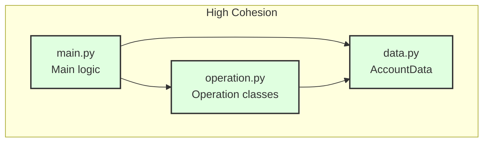

```mermaid
graph TD
    subgraph High Cohesion
        data[data.py<br/>AccountData]
        operation[operation.py<br/>Operation classes]
        main[main.py<br/>Main logic]
    end

    main --> operation
    main --> data
    operation --> data

    %% Coupling notes
    classDef highCohesion fill:#e0ffe0,stroke:#333,stroke-width:2px;
    class data,operation,main highCohesion;

    %% Cohesion/coupling explanation
    %% - main.py coordinates app flow (moderate cohesion)
    %% - operation.py encapsulates transaction logic (high cohesion)
    %% - data.py manages account state (high cohesion)
    %% - main.py is coupled to operation.py and data.py
    %% - operation.py is coupled to data.py
```