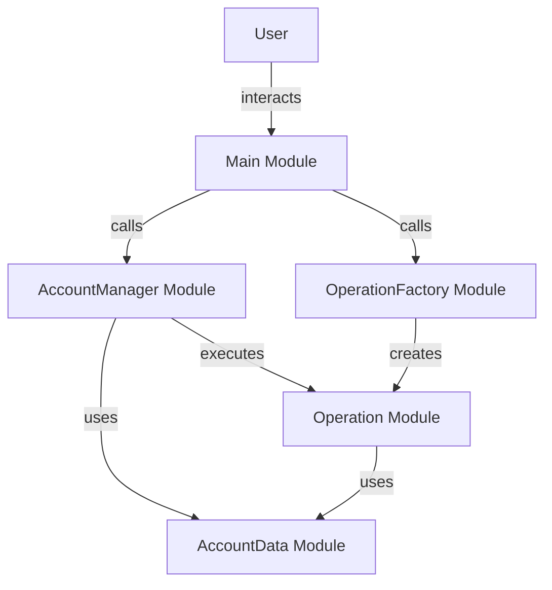

```mermaid
graph TD
    Main["Main Module"]
    AccountManager["AccountManager Module"]
    OperationFactory["OperationFactory Module"]
    Operation["Operation Module"]
    AccountData["AccountData Module"]

    %% Cohesion (internal relationships)
    AccountManager -->|uses| AccountData
    Operation -->|uses| AccountData

    %% Coupling (dependencies between modules)
    Main -->|calls| AccountManager
    Main -->|calls| OperationFactory
    OperationFactory -->|creates| Operation
    AccountManager -->|executes| Operation

    %% User interaction
    User["User"]
    User -->|interacts| Main
```