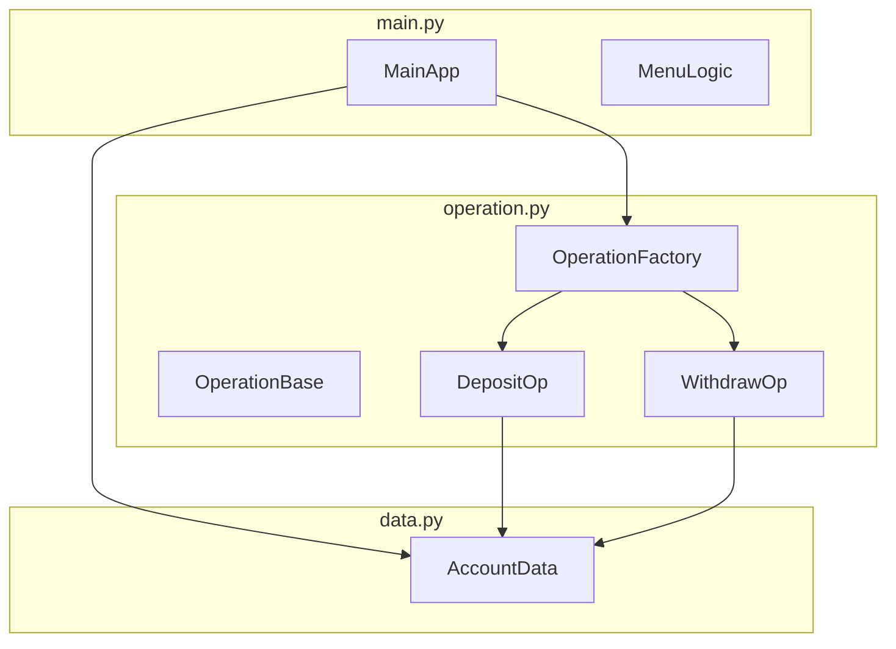

```mermaid
graph TD
    %% Modules (cohesion)
    subgraph main_py [main.py]
        MainApp
        MenuLogic
    end

    subgraph operation_py [operation.py]
        OperationBase
        DepositOp
        WithdrawOp
        OperationFactory
    end

    subgraph data_py [data.py]
        AccountData
    end

    %% Coupling (dependencies)
    MainApp --> OperationFactory
    MainApp --> AccountData
    OperationFactory --> DepositOp
    OperationFactory --> WithdrawOp
    DepositOp --> AccountData
    WithdrawOp --> AccountData
```